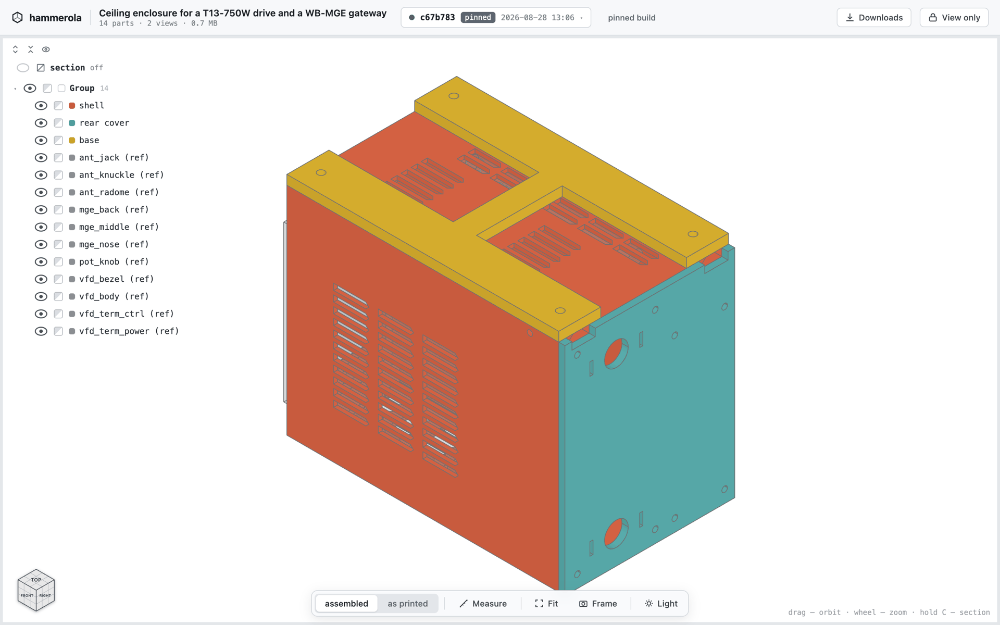
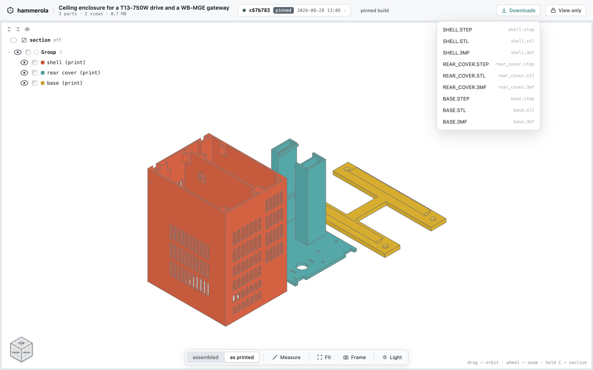

# hammerola

Builds CAD models from code and serves them in a browser. Push a model's source,
get back a page: turn the part, hide what is in the way, cut a section through
it, measure it, download it as STEP/STL/3MF. The name is from "pianola" — a
mechanism that plays itself.

<!-- Screenshots live in docs/images/ rather than in static/. static/ is the
     viewer payload that ships INSIDE the image, and its `hammerola*` names are
     generated and gitignored; README pictures are drawn by the forge straight
     out of the repository and have no business in a container. -->


## How it works

A model is a directory with a `model.py` in it. `hammerola commit` packs that
directory and posts it; the hub unpacks it, **computes the geometry itself** —
in a process of its own, with the CAD kernel that ships in its image — checks
the result, exports STEP/STL/3MF and serves the whole thing at a URL. Nothing is
built on the laptop, and no forge's CI is involved.

Four things follow from that, and between them they are what the tool is for.

**The hub names the revision, not you.** The id is the digest of the sources it
received, so `commit` means "publish a version of this" and has nothing to do
with git: a directory that is not a repository publishes exactly like one that
is, and the same tree pushed twice lands at the same address instead of making a
second one. git is consulted once, afterwards — `commit` *prints* a `git commit`
line recording what was published, for a person to run or ignore, and never runs
it.

**A published revision never changes and never expires.** Its URL is served as
immutable, and there is no retention anywhere on the hub — nothing ages out and
no build can be taken back on its own — so a link pasted into a chat shows the
same geometry a year later. `dev` is the other kind of slot: one per project,
rewritten by every `hammerola build`, no history, never listed, and it is where
the working copy goes while a part is still moving.

**Geometry that fails the gate is not published.** Every printable has to be a
valid solid with positive volume, export a watertight mesh and come out as one
body; the `print` view has to be a plate rather than a pile of parts modelled
inside one another; every printable has to appear in a view. A build that fails
any of it is thrown away whole — `latest` and `dev` do not move — and what comes
back is a failure code and the build's own log.

**The files are public and the code is not.** A build's page, its geometry and
its STEP/STL/3MF are anonymous: being given the link is what gets you the part.
The sources a revision was built from are kept too, but behind the one secret,
and so is the list of what exists on the hub at all.



## Publishing a model

The client is `hammerola`, and it lives in this repository on purpose: the
client and the hub share one contract — the archive shape, the path alphabet,
the ceilings, the job states — and it used to be split across two repositories
where no test could see both halves, which is exactly how publication came to be
broken without anyone noticing. It imports nothing outside the standard library,
so whatever `python3` a laptop already has is enough.

**It is installed from the hub**, which serves the three things a first run
needs and asks for no token for any of them — they are the software, identical
on every deployment, and the person downloading them does not have a token yet
by definition:

```bash
mkdir -p ~/.local/bin ~/.claude/skills/hammerola
curl -fsSL <hub>/start/hammerola -o ~/.local/bin/hammerola && chmod +x ~/.local/bin/hammerola
curl -fsSL <hub>/start/skill.md -o ~/.claude/skills/hammerola/SKILL.md   # for an agent
hammerola login <hub>   # once per machine; the password is prompted for
```

**That is the only install, checkout or no checkout.** There used to be a second
one — `make client`, which symlinked a `bin/hammerola` script into
`~/.local/bin` — and the two collided under the one name they share: `curl -o`
writes THROUGH a symlink, into its target, so the line above quietly landed the
downloaded zipapp on top of the repository's own file. The link stayed a link,
the command went on working, and the only sign was `git status` calling the
client modified. Both the target and the script are gone. Whoever is *working
on* the client runs it out of the checkout instead — and the whole trick is that
`python3` has to be able to import `src`, which is a statement about where the
command is STARTED, not about where the model is:

```bash
cd <this checkout>
python3 -m src.client --help                          # the same tool, off the working copy
python3 -m src.client -C <model dir> status           # the model directory is an argument
```

`-C` exists because there is no installed script to run from inside a model
directory: `python3 -m src.client` started there fails with
`No module named 'src'`, and so does `python3 -m src.client status` started in
the checkout — the tool resolves, and then finds no `project.json`. The other
way round works too, if the shell is already in the model:

```bash
PYTHONPATH=<this checkout> python3 -m src.client status
```

No venv and nothing to build either way: the package imports the standard
library and nothing else, which is the same property that lets the hub ship it
as one file.

The downloaded client is a zipapp built out of `src/client/` — one file, nothing
installed, python 3.9 and up (`src/onboarding.MIN_PYTHON`, which is also what
the skill tells the reader and what a test holds the syntax to: a stock
`/usr/bin/python3` is 3.9 on macOS and on Debian 11, so "newer than that" is a
first onboarding step that fails on the ordinary machine).

`GET /start` is the manifest that names both of those, plus the starter template
`create` fetches below — and one boolean, `empty`, which is the only thing on
this service that says anything about the deployment without the token. It is
deliberately never a count, a name or a date, and it fails closed: a project
directory the hub cannot read answers "not empty", rather than telling somebody
their hub is empty on the strength of an error. It is what the SIGN-IN PAGE of a
hub nobody has pushed to reads: instead of a login form and nothing else, it
draws five lines to hand an agent — where the skill is, where the client is,
what this hub's address is, install the skill and follow it, ask the owner for
the token. The addresses in it are built from the browser's own origin and the
manifest's paths, so nothing here names a deployment; the request is made only
when the form is what is on the screen, and every failure of it is silence.
`hammerola create` is the other reader, and it follows `template`. The manifest
also states the VERSION of the skill this image ships, which is what
`hammerola skill` compares a laptop's copy against; like the three paths it is a
constant of the image and says nothing about the deployment.
`src/onboarding.py` carries the argument for the boolean and for why it is
never a count.

Then, in the part's own directory — named first, because the name is what
`create` reads:

```bash
mkdir t13-ceiling-mount && cd t13-ceiling-mount                    # the directory names the project
hammerola create --title "T13 ceiling mount (t13-ceiling-mount)"   # once: project.json + template
hammerola build                                                    # publish the working copy into `dev`
hammerola commit -m "thicker plate"                                # publish an immutable revision
```

`create` fetches the starter template from the hub and unpacks it beside the
`project.json` it mints — a `model.py` that builds as it stands. It never writes
over anything that is already there, and `--no-template` is the form for a
directory that already has a model, or for a machine with no hub to reach: the
id has always been minted locally and still is.

The title ends with the directory's own slug in brackets, and `create` writes
that slug into `project.json` as a third key, `project` — the latin name the hub
publishes under, on the index card and in the build page header. It is decided
here because here is the only machine where it exists: a push is unpacked on the
hub under a name of the hub's own, so a build that worked the answer out for
itself would name the project after that.

Both publishing verbs do the same four things: pack the tree, post it, wait on
the build job the hub answers with, and print what the build printed — plus, for
`commit`, the name the hub gave the revision. The exit code is the point, because
it replaces a forge's job status: zero means a build was published, and a refused
push, a model that raised, a gate that said no and a hub that could not be
reached are each non-zero with the sentence that says which.

The rest of the commands answer questions about a project that is already there:

```bash
hammerola status                 # latest, dev, and the revisions that exist
hammerola log <revision>         # read a build log again
hammerola source <revision>      # the code a revision was built from
hammerola artifacts <revision>   # its STEP/STL/3MF
hammerola diff <rev> <rev>       # what moved, in geometry and in source
hammerola comments               # notes left on this project's builds
hammerola rename "New title"     # the title, never the id
hammerola skill                  # is the installed agent skill current?
hammerola skill update           # write the hub's copy over it
```

`skill` is the odd one out: it asks about this MACHINE rather than about a
project, and it exists because the skill is the only versioned thing here that
goes stale in silence — a client that is behind is refused and says so, while a
stale skill goes on confidently teaching a command that no longer exists. It
compares the version in the installed file's frontmatter against the one the hub
states in `/start`, and only ever writes when `update` was typed.

`hammerola --help` has the flags, and `hammerola rm` — the one command that
unmakes anything. It removes a project whole, never a single build, and it asks
for the id to be typed first.

## What a model.py looks like

<!-- THE EXAMPLE BELOW STAYS, AND SO DOES model_template/. An earlier note here
     asked for this block to be replaced by a pointer to the template the day
     the template landed (issue #31), on the argument that a contract
     must have ONE source or the second copy drifts in silence. The template
     has landed, and the argument does not apply: NEITHER COPY CAN DRIFT,
     because both are executed. This block is lifted out of README.md and
     built the way a push is built (tests/test_readme_example.py), and
     model_template/ is a working project run through the same build path
     (tests/test_template.py). Two copies that are both built are two copies
     that are both true.

     They are also for different readers. The template is where a project
     STARTS — `hammerola create` fetches it from the hub and unpacks it — and
     it is 12 KB of commented model. This one is short enough to read on the
     repository page without downloading anything, which is what somebody
     deciding whether to use the tool at all is doing.

     So do not delete either, and do not delete tests/test_readme_example.py:
     it is the only thing holding this block to the contract, and because the
     block is now meant to stay, that test FAILS rather than skips if the block
     goes -- a skip nobody reads is not a test. -->

Start a project from the template — `hammerola create` brings it, and it builds
as it stands. What follows is the same contract at a size that can be read here
without downloading anything.

Three functions and one import are the whole contract. `printables()` says what
gets exported and offered for download; `views()` says what the viewer shows,
one tab per view; `checks()` is optional and holds this part to its own numbers.
The geometry comes from `cadquery`, and the shared checks from `checklib` — the
third bullet below says what that one carries.

```python
"""A flat mounting plate: one printed part, driven by the numbers at the top."""

import cadquery as cq

import checklib

LENGTH = 60.0     # along X
WIDTH = 40.0      # along Y
THICKNESS = 4.0   # of the plate
HOLE = 5.5        # M5 clearance, ISO 273
HEAD = 8.5        # M5 socket cap head, ISO 4762
INSET = 8.0       # hole centres in from each edge


def hole_centres():
    x, y = (LENGTH - 2 * INSET) / 2, (WIDTH - 2 * INSET) / 2
    return [(sx * x, sy * y) for sx in (-1, 1) for sy in (-1, 1)]


def plate():
    return (cq.Workplane("XY").box(LENGTH, WIDTH, THICKNESS)
            .faces(">Z").workplane()
            .pushPoints(hole_centres()).hole(HOLE))


def printables():
    """What the download buttons hand out. The key is the filename stem."""
    return {"plate": plate()}


def views():
    """One tab each. `assembled` is the product, `print` is the bed.

    They hold the same list here only because there is one part: a single part
    is already its own bed layout. With two, `print` is where you move them
    apart, and the gate refuses a `print` view whose parts overlap.
    """
    part = plate()
    return [
        {"id": "assembled", "name": "assembled",
         "parts": [{"shape": part, "name": "plate"}]},
        {"id": "print", "name": "as printed",
         "parts": [{"shape": part, "name": "plate"}]},
    ]


def checks():
    """Optional. Measure the solid rather than restate the numbers above.

    It may take one argument — the directory the build has already exported
    into — for a check that reads the files instead of the geometry.
    """
    part = plate()
    holes = part.faces("%CYLINDER").vals()
    assert len(holes) == 4, f"the plate has {len(holes)} bores, not 4"

    # The shared version of "the screw head has something to bear on". The box
    # is centred, so the seat is the top face at +THICKNESS/2 and the head has
    # the whole plate under it. A check may also report by returning strings.
    problems = []
    for x, y in hole_centres():
        problems += checklib.material_under_head(
            part, (x, y, THICKNESS / 2), HEAD, THICKNESS, name="plate")
    return problems
```

Beside `project.json`, which `hammerola create` writes, that file is the whole
project. Four things about it are worth knowing before writing the second one:

* **A part in a view needs `shape` and `name`; `color` and `alpha` are
  optional.** The colour is decided by SHAPE and never by the name: an object
  in a view gets a palette colour when it is one of the solids `printables()`
  returned — moved and turned as much as you like — and everything else comes
  out grey. So the picture says by itself what is going on the bed and what is
  a bought part shown for reference, and a stand-in stays grey however you
  label it.
* **`checks()` runs on the hub, and a demonstrably empty one is refused.** The
  build counts the checks in the function's own source, and refuses a body with
  no assert, no raise, nothing filling the list it returns and not so much as a
  call in it — a function that passes for that reason is worse than no
  function. A body it cannot count is not refused: a comprehension, a table of
  checks or a helper handed the problem list gets `count unknown` in the log
  and publishes.
* **`import checklib` is part of the contract**, next to those three names: it
  carries the checks that keep coming up — every pair of parts checked for
  shared volume, a mating face that has to stay flat, material under a screw
  head — so a fix to one of them reaches every project instead of one.
* **Dependencies come from the image and nowhere else.** Nothing is installed on
  a model's say-so, so `model.py` imports what the hub already has: `cadquery`,
  `checklib`, the standard library, and whatever the project ships beside it.

## Running a hub

**A hub is one Docker image, and everything it needs is inside it.** That is not
packaging convenience, it is the architecture: the CAD kernel is in the image
(`cadquery` and the native OpenCASCADE binding, with the seven X/GL/expat system
libraries it needs), and nothing is ever installed on a model's say-so — a
`model.py` gets what the image already has and nothing more. The browser bundle
is compiled in a `node:22` stage that never reaches the runtime image, so a
service that is Python does not ship a node toolchain. Alongside them travel the
page templates, the viewer payload, the starter template and the client's own
sources: the one-file zipapp behind `/start/hammerola` is assembled out of those
when the request arrives.

CI builds and publishes it — `.gitea/workflows/image-check-publish.yml`, on every
push:

```
gitea.vvzvlad.xyz/projects/hammerola:latest     # main, what a deploy pulls
gitea.vvzvlad.xyz/projects/hammerola:<sha>      # main, the rollback point
gitea.vvzvlad.xyz/projects/hammerola:<branch>   # anything else
```

`:latest` is pushed LAST of the two, so it moving is the commit of the whole
publication: if `:<sha>` fails to reach the registry the run stops before
`:latest` moves, and what is deployed keeps running the previous image. Only
`main` ever writes `:latest` — a side branch publishes under its own name and
cannot overwrite what production pulls. Do not count on every commit having a
`:<sha>`: a run still queued when the next push lands is cancelled, and with a
build measured in tens of minutes that is ordinary rather than exceptional.

Between the build and the push sits a gate,
`ci/smoke.py`, which starts the image and asks it what a test suite structurally
cannot, because the suite runs against a checkout and never looks at the
artefact: that the entrypoint drops privileges for real, that the
missing-variable guard fires and names the variable, that `.dockerignore` kept
the tests and the `.env` out, that the CAD kernel imports, and that `/start`
really answers. Nothing reaches the registry until it is green, which is also
why `docker login` runs *after* it and never before.

Locally the same image is a plain build with no arguments — but expect it to be
big and slow. The CAD kernel brings VTK with it, hard-pinned by `cadquery-ocp`
itself, and that alone is about 0.6 GB the hub never renders with; it is carried
anyway, because the only way out is substituting a different distribution behind
the declared dependency, and that trade was decided against.

```bash
docker build -t hammerola .
```

**Deploying is `docker-compose.yml` in this repository** — a template with
placeholder values that pulls `gitea.vvzvlad.xyz/projects/hammerola:latest`. Do
not build on the host that serves it. Four things in it are load-bearing rather
than decorative, and each one is spelled out at length in the file itself:

* **One volume at `/app/data`.** Every build, pointer, source tree, comment and
  job lives there; nothing ages out, so it grows monotonically and is cleared by
  hand. The volume's real name is `<stack>_<key>`, composed at deploy time —
  getting it wrong does not fail, it silently starts the service from a fresh
  empty one with all the state still sitting in the volume nothing references.
* **One secret, `EDIT_TOKEN`.** It is what publishing, the sources, the log, the
  comment queue, renaming and removing all check; everything else has a default
  in `src/settings.py`. Without it the service refuses to start and says which
  variable is missing, rather than coming up half-configured.
* **Non-root, by the entrypoint and not by the Dockerfile.** It starts as root,
  fixes ownership of the volume and drops to `app` (uid 1000) with gosu. Nothing
  declares a `USER`, so removing the entrypoint silently gives the service root
  back — which is exactly why the gate checks it on the built image.
* **No `EXPOSE`, and compression at the edge.** The port is published by the
  reverse proxy through compose labels, and so is gzip: a view is JSON in the
  megabytes that compresses about 6.5×, and the application deliberately does
  not compress anything itself. The healthcheck's timings are part of the deploy
  mechanism too — an update that cannot report healthy inside its window is
  rolled back, and a long `interval` with no `start_period` gets a perfectly
  good image rolled back for nothing.

**Working on the hub is the other mode**, and it needs no docker at all.
Everything routine is wrapped in the `Makefile` (`make help` lists all targets):

```bash
make install                # create .venv + install dev/test deps
cp .env.example .env        # fill in the values
make test                   # run tests
make run                    # run the app
```

Python targets create and reuse a local `.venv` automatically — you never need
the system Python. node is needed by the frontend targets only: `make ui`,
which builds the browser bundle, and `make ui-test`, which runs the JS suite.
Both refuse to run without npm. `make test` does not refuse — it runs the
Python suite either way and then says out loud that it skipped the browser
half. What `make run` cannot give you is the CAD kernel unless the machine
happens to have it: a workstation without it serves every page and refuses every
build, which is the one thing the image is there for.

## Where the rest is written down

| File | What it holds |
| --- | --- |
| `AGENTS.md` | The conventions this repository is written by, and what every directory in it is for. Start here before changing anything. |
| `docs/SPEC.md` | The requirements, the facts that were verified the hard way, and the work plan. |
| `ui/README.md` | The browser interface: its layout, its pins, and why it is built twice. |
